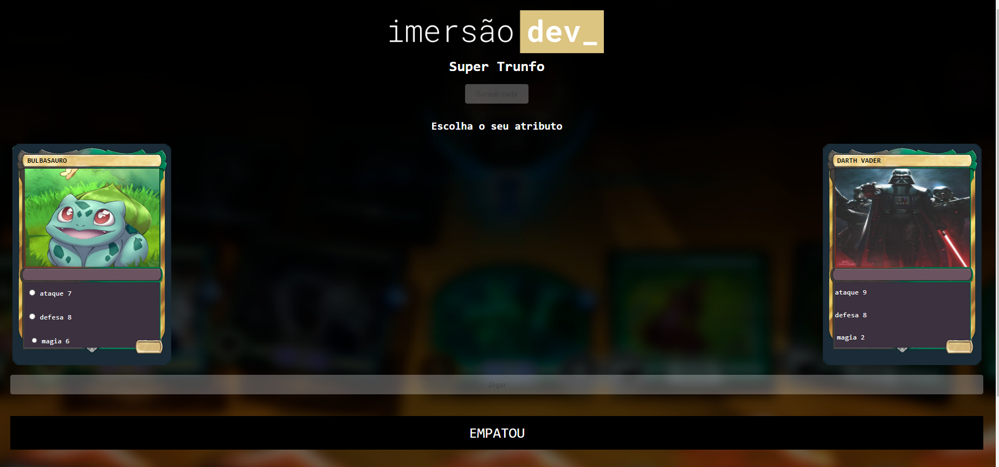

# Projeto Super Trunfo

Criar um jogo de super trunfo com figuras dos personagens favoritos.

| :placard: Vitrine.Dev |     |
| -------------  | --- |
| :sparkles: Nome        | **Projeto Super Trunfo**
| :label: Tecnologias | javascript, html, css
| :rocket: URL         | https://thamyresmya.github.io/Super-Trunfo/
| :fire: Desafio     | Criar um jogo de super trunfo

<!-- Inserir imagem com a #vitrinedev ao final do link -->

## Detalhes do projeto

Projeto realizado pela imersão da alura, jogo super trunfo.
Você joga contra o computador.

Passo a passo:

- click em "Sortear carta"
- Selecione um atributo entre: Ataque - Desefa - Magia
- click em "Jogar"

As cartas são aleatorias.

